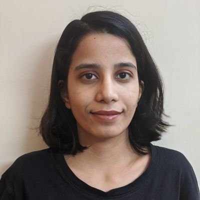

{: .float-left width="25%" style="border-radius:15px" .mr-4}  

I am interested in problems involving computer vision, machine learning with real world applications. I am a first-year PhD at [ELLIS Unit Amsterdam](https://ivi.fnwi.uva.nl/ellis/) and [VIS lab](https://ivi.fnwi.uva.nl/vislab/), [University of Amsterdam](https://www.uva.nl/en), advised by [Pascal Mettes](https://staff.fnwi.uva.nl/p.s.m.mettes/index.html) and [Rita Cucchiara](http://personale.unimore.it/Rubrica/dettaglio/cucchiara).  
{: style="text-align: justify"}
I was one of the organizers of [Women in Computer Vision Workshop](https://sites.google.com/view/wicv/), co-hosted with [CVPR 2021](http://cvpr2021.thecvf.com/) and [CVPR 2022](http://cvpr2022.thecvf.com/). In my free time, I enjoy playing ukulele, [reading books](/more.html) and occasionally, exploring some [computational art](/art.html)!
{: style="text-align: justify"}

# highlights

Sep 2022 | I presented a poster on our NeurIPS 2022 [paper](https://arxiv.org/abs/2206.08704) the [ELLIS Doctoral Symposium 2022](https://ellisalicante.org/eds2022/) in Alicante, Spain!
Sep 2022 | Our work on Maximum Separation is accepted to NeurIPS 2022 ! I will be presenting this work at the conference and the Women in Machine Learning workshop.
Jun 2022 | New preprint on arXiv!: [Maximum Class Separation as Inductive Bias in One Matrix](https://arxiv.org/abs/2206.08704)
Jun 2022 | We organized the in-person and virtual [Women in Computer Vision Workshop](https://sites.google.com/view/wicvcvpr2022/home) at CVPR 2022!
Nov 2021 | Teaching Assistant for Applied Machine Learning course
Oct 2021 | I joined PhD at VIS Lab, University of Amsterdam.
Oct 2021 | We organized the Women in Computer Vision (WiCV) [Social](https://iccv2021.thecvf.com/networking-sessions) at ICCV 2021!
Jun 2021 | We organized the [Women in Computer Vision Workshop](https://sites.google.com/view/wicvcvpr2021/home) at CVPR 2021!
Nov 2020 | I was featured on [ResearcHers Code](https://www.researcherscode.com/twitter-contributors) [twitter](https://twitter.com/search?q=from%3AResearchersCode%20since%3A2020-11-02%20until%3A2020-11-09&src=typed_query&f=live). ResearcHers Code is an international community supporting cis & trans women & non-binary working in computational sciences, technology and research. I talked about my research and other related topics like SciComm, PhD admissions.
Aug 2020 | Presented [poster](https://smiles.skoltech.ru/poster-presentations) on Region based Active Learning for Semantic Segmentation at **Summer School of Machine Learning at Skoltech (SMILES)**
Aug 2019 |  Reviewed papers for **Women in Machine Learning (WiML) workshop**, co-located with **NeurIPS 2019**.
Jun 2019 |  Defended my Master's [thesis](http://web2py.iiit.ac.in/research_centres/publications/view_publication/mastersthesis/769)!
May 2019 | Started working as Computer Vision Researcher at **Research and Technology Center, Bosch**. Excited to work on problems related to Autonomous Driving. \| Collaborators: [Amit Kale](https://www.linkedin.com/in/kaleamit/), [Yasaswi Bharadwaj](https://www.linkedin.com/in/yasaswi-bharadwaj-katta-87647555), [Hiranmai M.](https://www.linkedin.com/in/hiranmai-4b0a3398/), [Subramanya Bharadwaj](https://www.linkedin.com/in/subramanya-bharadwaj-63b10758/)
Nov 2018 | Paper on _Region Based Active Learning for Efficient Labelling in Semantic Segmentation_ accepted to [WACV 2019](http://wacv19.wacv.net) [[link]](https://ieeexplore.ieee.org/document/8659293)
Jun 2018 - Oct 2018 | Interning at **Research and Technology Center, Bosch**. \| Mentors: [Guruprasad Hegde](https://www.linkedin.com/in/guruprasad-hegde-657b81a/),  [Amit Kale](https://www.linkedin.com/in/kaleamit/)
Apr 2018 | Presenting our work on **Active Learning for Semantic Segmentation** at 1st Research Symposium, IIIT Hyderabad

# publications

Maximum Class Separation as Inductive Bias in One Matrix  

 Tejaswi Kasarla, [Gertjan J. Burghouts](https://sites.google.com/site/gertjanburghouts/){: .text-grey-dk-300}, [Max van Spengler](https://nl.linkedin.com/in/max-van-spengler-45908b147){: .text-grey-dk-300}, [Elise van der Pol](https://www.elisevanderpol.nl){: .text-grey-dk-300}, [Rita Cucchiara](https://aimagelab.ing.unimore.it/imagelab/person.asp?idpersona=1){: .text-grey-dk-300}, [Pascal Mettes](https://staff.fnwi.uva.nl/p.s.m.mettes/){: .text-grey-dk-300}  
NeurIPS 2022 [(Oral)](){: .text-red-300}

[paper](https://arxiv.org/abs/2206.08704){: .btn .btn-outline .mr-2 target="_blank"} [code](https://github.com/tkasarla/max-separation-as-inductive-bias){: .btn .btn-outline target="_blank" }

Region-Based Active Learning for Efficient Labelling in Semantic Segmentation  

Tejaswi Kasarla, [G Nagendar](https://in.linkedin.com/in/nagendar-g-257305113){: .text-grey-dk-300}, [Guruprasad Hegde](https://in.linkedin.com/in/guruprasad-hegde-657b81a){: .text-grey-dk-300}, [Vineeth N. Balasubramanian](https://people.iith.ac.in/vineethnb/){: .text-grey-dk-300}, [C.V. Jawahar](https://faculty.iiit.ac.in/~jawahar/){: .text-grey-dk-300}  
WACV 2019

[paper](https://ieeexplore.ieee.org/document/8659293){: .btn .btn-outline .mr-2 target="_blank"} [supplementary](https://drive.google.com/file/d/1N3VXOKCNsdL2MySr7EXJV5DcAymV632z/view?usp=sharing){: .btn .btn-outline .mr-2 target="_blank"} [poster](assets/poster_wacv.pdf){: .btn .btn-outline .mr-2 target="_blank"}

