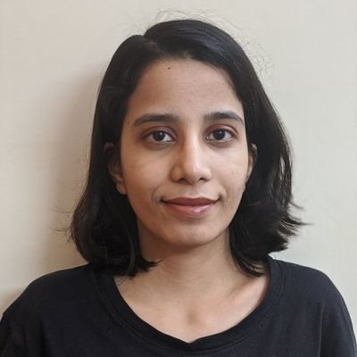

I am an ELLIS PhD student at [**University of Amsterdam**](https://www.uva.nl/en){: .text-grey-dk-100}, advised by [Pascal Mettes](https://staff.fnwi.uva.nl/p.s.m.mettes/index.html). My main research is in non-Euclidean representation learning (especially hyperbolic and hyperspherical representation spaces) and their applications to open-world visual recognition and multimodal foundation models. More recently, I am interested in how the geometry of the representation space can structure and ground embodied world models, so that agents can reason about actions and uncertainty at multiple levels of abstraction.

I was a visiting researcher at [**UNIMORE**](https://www.unimore.it/){: .text-grey-dk-100} with [Rita Cucchiara](https://aimagelab.ing.unimore.it/imagelab/person.asp?idpersona=1) and a research intern at **Meta FAIR** with [Pascale Fung](https://www.linkedin.com/in/pascale-fung-a3aa05139). I care deeply about building inclusive research communities. I co-organized the [Women in Computer Vision (WiCV)](https://sites.google.com/view/wicv/) Workshop at CVPR 2021 & 2022 and have served on the WiCV board since 2022. 

Outside academia, I am a photographer and home barista, always in search of good light and a [perfect cup](/more/#coffee) wherever I go!

  <a href="mailto:t.kasarla@uva.nl" data-label="Email"><i class="fas fa-envelope"></i>Email</a>
  <a href="https://scholar.google.com/citations?hl=en&user=e_mkTxMAAAAJ&view_op=list_works&sortby=pubdate" data-label="Scholar" target="_blank"><i class="fas fa-graduation-cap"></i>Scholar</a>
  <a href="/cv" data-label="CV"><i class="fas fa-file-lines"></i>CV</a>
  <a href="https://github.com/tkasarla" data-label="GitHub" target="_blank"><i class="fab fa-github"></i>GitHub</a>
  <a href="https://www.linkedin.com/in/tejaswikasarla/" data-label="LinkedIn" target="_blank"><i class="fab fa-linkedin"></i>LinkedIn</a>
  <a href="https://twitter.com/tkasarla_" data-label="Twitter" target="_blank"><i class="fab fa-x-twitter"></i>Twitter</a>

# news

| Date | Event |
|------|-------|
| Apr 2026 | Our work on [Balanced Hyperbolic Embeddings are Natural Out-of-Distribution Detectors](https://link.springer.com/article/10.1007/s11263-026-02775-6) is accepted to IJCV! |
| Jan 2026 | Our work on [Action100M: A Large-scale Video Action Dataset](https://arxiv.org/abs/2601.10592) is available as a preprint on arXiv! |
| Jun 2025 | I started an internship at [Meta FAIR](https://ai.meta.com/research/) in Paris. I will spend the next 6 months working on multimodal LLMs. |
| Apr 2025 | I will be a TA for the [Foundation Models (FoMo)](https://uvafomo.github.io) course at UvA. |
| Mar 2025 | Our work on [Hyperbolic Safety-Aware Vision-Language Models](https://arxiv.org/abs/2503.12127) is accepted to CVPR 2025 as a Highlight! I will be presenting this work in-person at the conference. |
| Jun 2024 | Visiting [Rita Cucchiara](https://aimagelab.ing.unimore.it/imagelab/person.asp?idpersona=1) at [University of Modena and Reggio Emilia](https://www.unimore.it/) until September 2024. |
{: .news-table}

# featured publications

**CVPR 2026 EgoVis Workshop**
{: .pub-venue}

[Action100M: A Large-scale Video Action Dataset](https://github.com/facebookresearch/Action100M){: target="_blank"}
{: .pub-title}

[Delong Chen](https://chendelong.world), **Tejaswi Kasarla**, [Yejin Bang](https://www.linkedin.com/in/yejinbang/), [Mustafa Shukor](https://mustafashukor.github.io), [Willy Chung](https://willyhc22.github.io), [Jade Yu](https://jadeleiyu.github.io), [Allen Bolourchi](https://www.linkedin.com/in/allenbolourchi/), [Théo Moutakanni](https://www.linkedin.com/in/theo-moutakanni), [Pascale Fung](https://www.linkedin.com/in/pascale-fung-a3aa05139)
{: .pub-authors}

[project page](https://github.com/facebookresearch/Action100M){: .pub-link target="_blank"} [paper](https://www.arxiv.org/abs/2601.10592){: .pub-link target="_blank"} [dataset](https://huggingface.co/datasets/facebook/action100m-preview){: .pub-link target="_blank"} <button class="pub-link bibtex-button" data-paper-id="action100m">bibtex</button>
{: .pub-links}

**IJCV 2026**
{: .pub-venue}

[Balanced Hyperbolic Embeddings are Natural Out-of-Distribution Detectors](/papers/balanced-hyperbolic/)
{: .pub-title}

**Tejaswi Kasarla**, [Max van Spengler](https://www.linkedin.com/in/max-van-spengler-45908b147), [Pascal Mettes](https://staff.fnwi.uva.nl/p.s.m.mettes/)
{: .pub-authors}

[project page](/papers/balanced-hyperbolic){: .pub-link} [paper](https://arxiv.org/abs/2503.12127){: .pub-link target="_blank"} <button class="pub-link bibtex-button" data-paper-id="balanced-hyperbolic">bibtex</button>
{: .pub-links}

**CVPR 2025** · ★ Highlight 
{: .pub-venue}

[Hyperbolic Safety-Aware Vision-Language Models](https://aimagelab.github.io/HySAC/){: target="_blank"}
{: .pub-title}

[Tobia Poppi\*](https://tobiapoppi.github.io), **Tejaswi Kasarla\***, [Pascal Mettes](https://staff.fnwi.uva.nl/p.s.m.mettes/), [Lorenzo Baraldi](https://www.lorenzobaraldi.com), [Rita Cucchiara](https://aimagelab.ing.unimore.it/imagelab/person.asp?idpersona=1)
{: .pub-authors}

[project page](https://aimagelab.github.io/HySAC/){: .pub-link target="_blank"} [paper](https://arxiv.org/abs/2503.12127){: .pub-link target="_blank"} [code](https://github.com/aimagelab/HySAC){: .pub-link target="_blank"} [model](https://huggingface.co/aimagelab/HySAC){: .pub-link target="_blank"} <button class="pub-link bibtex-button" data-paper-id="hyperbolic-safety">bibtex</button>
{: .pub-links}

**NeurIPS 2022** · ★ Oral  
*Also a contributed talk at [WiML Workshop](https://sites.google.com/view/wiml2022/program) @ NeurIPS 2022*
{: .pub-venue}

[Maximum Class Separation as Inductive Bias in One Matrix](/papers/max-separation-as-inductive-bias/)
{: .pub-title}

**Tejaswi Kasarla**, [Gertjan J. Burghouts](https://sites.google.com/site/gertjanburghouts/), [Max van Spengler](https://nl.linkedin.com/in/max-van-spengler-45908b147), [Elise van der Pol](https://www.elisevanderpol.nl), [Rita Cucchiara](https://aimagelab.ing.unimore.it/imagelab/person.asp?idpersona=1), [Pascal Mettes](https://staff.fnwi.uva.nl/p.s.m.mettes/)
{: .pub-authors}

[project page](papers/max-separation-as-inductive-bias/){: .pub-link} [paper](https://arxiv.org/abs/2206.08704){: .pub-link target="_blank"} [code](https://github.com/tkasarla/max-separation-as-inductive-bias){: .pub-link target="_blank"} [poster](https://nips.cc/media/PosterPDFs/NeurIPS%202022/55160.png?t=1669329923.0358245){: .pub-link target="_blank"} [media](https://ivi.uva.nl/content/news/2022/11/phd-student-improves-image-classification.html){: .pub-link target="_blank"} <button class="pub-link bibtex-button" data-paper-id="max-separation">bibtex</button>
{: .pub-links}

<a href="/publications/">see all publications →</a>

